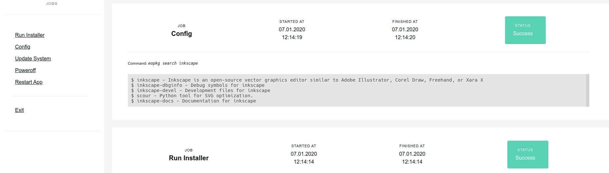

# RemoteRun

RemoteRun is a simple useful tool to run commands and files remotely through a web interface. It requires minimal setup and configuration. 

## Features

    - Run multiple jobs
    - log the job stdout
    - simple setting and configuration file
   

## Manual

1. Login with Password via Browser. The Password should be saved in a separate file.

2. Start a program located in /usr/local/bin using a browser, remotely, via the click of one button. One button per file. Manage them via an yaml file.

3. Show the console output in the browser and show when the process finished.

___

### How to use!
1. Get settings file ready: $ mv setting.example.yaml private/settings.yaml
2. Add the files at settings.yaml
3. Run $ meteor
4. Examine the app at http://localhost:3000 
5. Enable SSL for local testing, see: https://github.com/zdavatz/remoterun/issues/3
